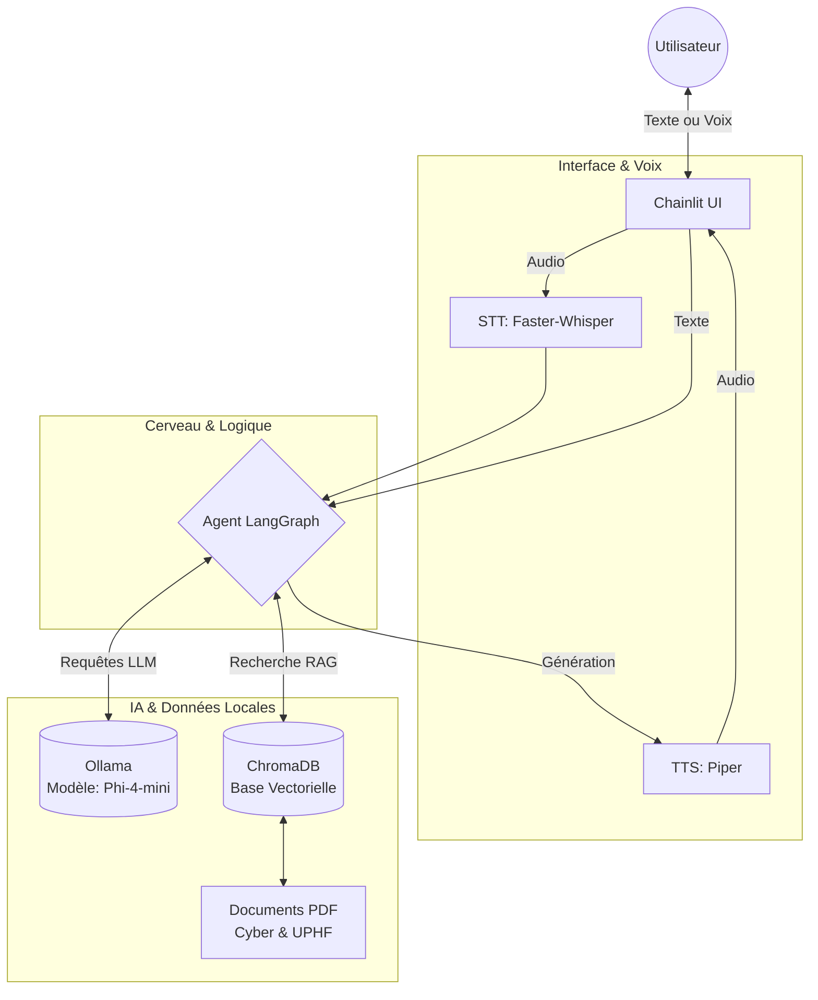
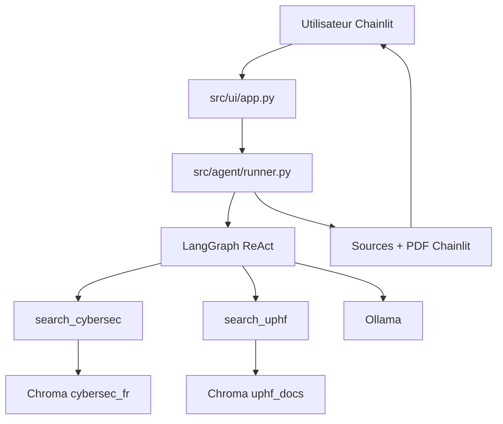

# 🍟 F.R.I.T.E.S. 
**Filtrage des Risques Informatiques et Transmission d'Eveil à la Sécurité**

Bienvenue sur le dépôt GitHub du projet F.R.I.T.E.S. Un agent conversationnel (chatbot) d'assistance en cybersécurité, conçu pour apprendre la cyber à toutes les sauces à l'UPHF.

---

## 🏗️ Architecture du Projet

Voici l'architecture technique simplifiée de l'application :



Plus spécifiquement :



## 📋 Prérequis

* **Docker Desktop** (recommandé pour un déploiement sans conflit).
* **Python 3.11** (si exécution en local sans Docker).
* Les modèles vocaux Piper (voir section *Voix*).

---

## ⚙️ Variables d'Environnement (`.env`)

À la racine du projet, créez un fichier nommé `.env`. Ce fichier est ignoré par Git pour des raisons de sécurité. Il doit contenir a minima la configuration de connexion aux conteneurs :

```env
# Connexion à l'IA locale
OLLAMA_URL=http://ollama:11434
OLLAMA_MODEL=phi4-mini

# Connexion à la base de données documentaire
CHROMA_HOST=chromadb
CHROMA_PORT=8000

# Variables de test optionnelles
RUN_OLLAMA_TESTS=0
```

## 🚀 Installation & Lancement

L'application est conteneurisée pour éviter les conflits de dépendances (notamment sur Windows).

### Méthode 1 : Avec Docker (Recommandée)
1. Assurez-vous que Docker Desktop est lancé.
2. Ouvrez un terminal à la racine du projet et exécutez le build :
   ```bash
   docker compose up --build
   ```
3. Docker va télécharger les images (Ollama, ChromaDB) et compiler l'application.
4. Ouvrez votre navigateur sur : http://localhost:8000

### Méthode 2 : En Local (Environnement de développement)
1. Créez un environnement virtuel et installez les dépendances :
    ```bash
    python3.11 -m venv .venv
    source .venv/bin/activate  # (Sur Windows: .venv\Scripts\activate)
    pip install -r requirements.txt
    ```
2. Installez le modèle Ollama manuellement sur votre machine : `ollama pull phi4-mini`
3. Lancez Chainlit :
    ```bash
    python -m chainlit run app.py -w
    ```
## 🎙️ Voix (STT / TTS)
L'agent est capable d'écouter et de parler. L'inférence est calculée localement sur le processeur (CPU).
* STT (Reconnaissance vocale) : Assurée par faster-whisper. Note : L'importation du modèle utilise du Lazy Loading pour ne pas bloquer les  démarrages applicatifs pendant les tests.

* TTS (Synthèse vocale) : Assurée par piper. 

    ⚠️ Action requise : Le modèle Piper est trop lourd pour Git. Vous devez télécharger le modèle vocal (fr_FR-upmc-medium.onnx et son fichier .json) et le placer dans l'arborescence stricte suivante :
    
    `models/piper/fr_FR-upmc-medium.onnx`

## 📚 Sources PDF (RAG)
Pour que l'agent puisse répondre aux questions spécifiques à l'UPHF, il utilise le RAG (Retrieval-Augmented Generation).
Les documents sources (PDFs de l'eduVPN, MFA, Charte informatique, etc.) doivent être placés dans le dossier d'ingestion prévu à cet effet (data/knowledge/cybersec et data/knowledge/uphf).

Ils sont ensuite vectorisés par Sentence-Transformers et stockés dans ChromaDB. Un filtre de distance ($L2 < 10.0$) empêche l'IA d'utiliser des documents hors-sujet.

Les documents étant sotckés localement, il faut générer les collection dans ChromaDB lors de l'installation.
Pour cela, il suffit d'exécuter l'un des scripts ingest_all.ps1 ou ingest_all.sh respectivement pour Windows et linux.
A noter que cette action est requise après chaque modification des documents sources, la base de donné sera ainsi supprimé puis recréer avec les documents dans data/knowledge/cybersec et data/knowledge/uphf.

## 🧪 Tests Unitaires & CI
Le projet dispose d'une suite de tests automatisée propulsée par pytest et GitHub Actions.

Pour lancer les tests légers localement (version rapide, sans charger les lourds modèles IA en mémoire) :
```bash
pytest tests/unit -q -m "not integration and not ollama and not slow"
```

Comportement de la CI :

À chaque Pull Request vers develop ou main, GitHub Actions exécute automatiquement le workflow de qualité (black, flake8, pytest ciblé) et vérifie que la compilation Docker (docker-compose build) est fonctionnelle.

## Git Flow : Comment travailler sur ce projet ?

Nous utilisons **Git Flow** pour organiser notre travail et éviter les conflits. 

### Les branches principales
* **`main`** : Contient uniquement le code stable et fonctionnel (production).
* **`develop`** : Branche d'intégration continue. C'est ici que toutes les nouvelles fonctionnalités sont fusionnées.

### Créer une nouvelle fonctionnalité
Ne **jamais** travailler directement sur `main` ou `develop`. 
Pour chaque tâche, créez une branche `feature` depuis `develop` :

1. Démarrer la fonctionnalité :
```bash
   git flow feature start nom-de-ma-tache
```

### Le merge ça se passe comment ?
Créez une PR (**Pull Request**) ou demandez à votre **`Chef de Projet`** préféré : je m'en occuperais. Dans tous les cas, les branches `main` et `develop` sont protégées donc vous ne pourrez pas merge vos `feature/...` directement dessus.

### Si j'ai un doute ?
N'hésitez pas à jeter un coup d'oeil à cette magnifique [cheatsheet](https://danielkummer.github.io/git-flow-cheatsheet/index.fr_FR.html).

### Comment je vérifie que mon code est fonctionnel ?
Même plus besoin de tout vérifier à la main ! Votre **`Chef de Projet`** dévoué vous a créé un des workflow (`ci.yml` et `docker-build.yml`) qui vérifient les erreurs de :
 * formatage du code
 * syntaxe
 * importation

Et accessoirement qu'il n'y a pas de problèmes avec le build du Docker.

&rarr; Pour checker ça, il suffit de commit & push sur sa branche `feature/...` et d'aller dans la section `Actions` sur GitHub (les tests prennent quelques minutes.