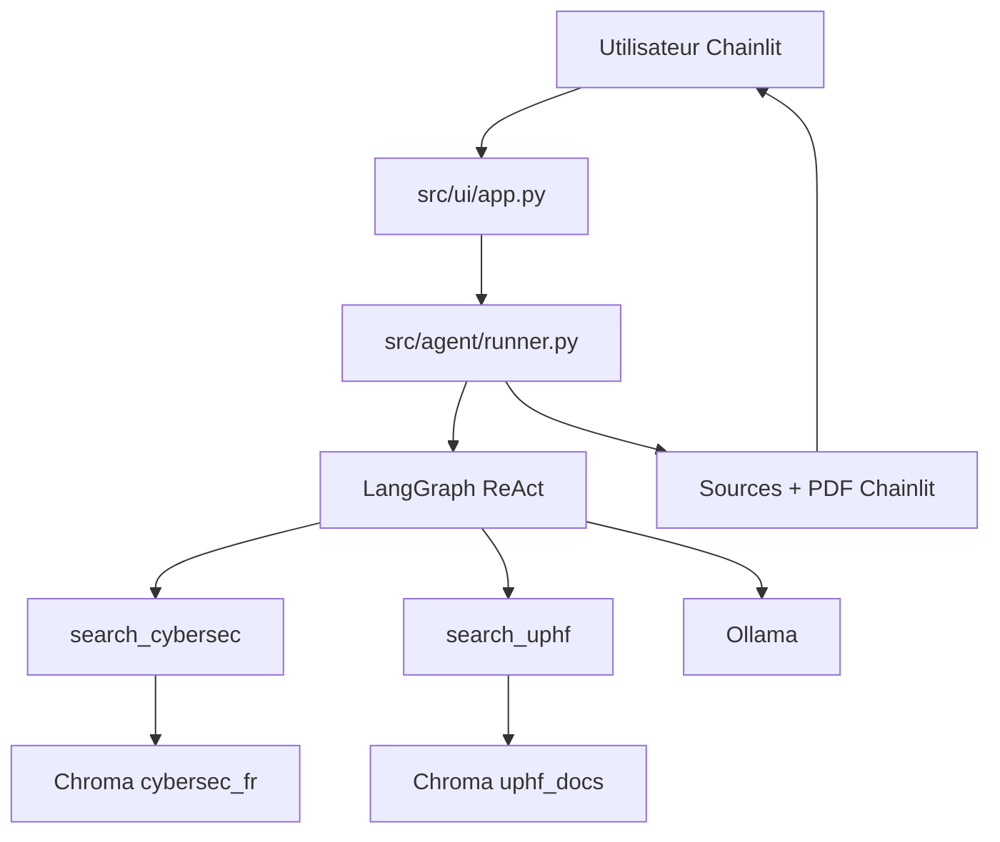

# Agent de Sécurité UPHF

Bienvenue sur le dépôt du projet de chatbot d'éveil à la cybersécurité de l'UPHF. 

## Git Flow : Comment travailler sur ce projet ?

Nous utilisons **Git Flow** pour organiser notre travail et éviter les conflits. 

### Les branches principales
* **`main`** : Contient uniquement le code stable et fonctionnel (production).
* **`develop`** : Branche d'intégration continue. C'est ici que toutes les nouvelles fonctionnalités sont fusionnées.

### Créer une nouvelle fonctionnalité
Ne **jamais** travailler directement sur `main` ou `develop`. 
Pour chaque tâche, créez une branche `feature` depuis `develop` :

1. Démarrer la fonctionnalité :
```bash
   git flow feature start nom-de-ma-tache
```

### Le merge ça se passe comment ?
Si vous êtes **sûrs** que y'a pas de conflits (ou que vous êtes chauds), vous pouvez merge votre branche `feature` avec la branche `develop`. Sinon, demandez à votre **`Chef de Projet`** préféré : je m'en occuperais.

Dans **TOUS LES CAS**, ne faites **PAS** de merge sur la `main`. Je m'en occuperais.

### Si j'ai un doute ?
N'hésitez pas à jeter un coup d'oeil à cette magnifique [cheatsheet](https://danielkummer.github.io/git-flow-cheatsheet/index.fr_FR.html).


## Architecture actuelle

